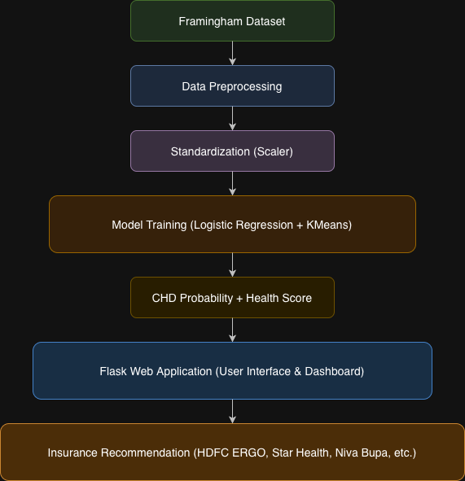
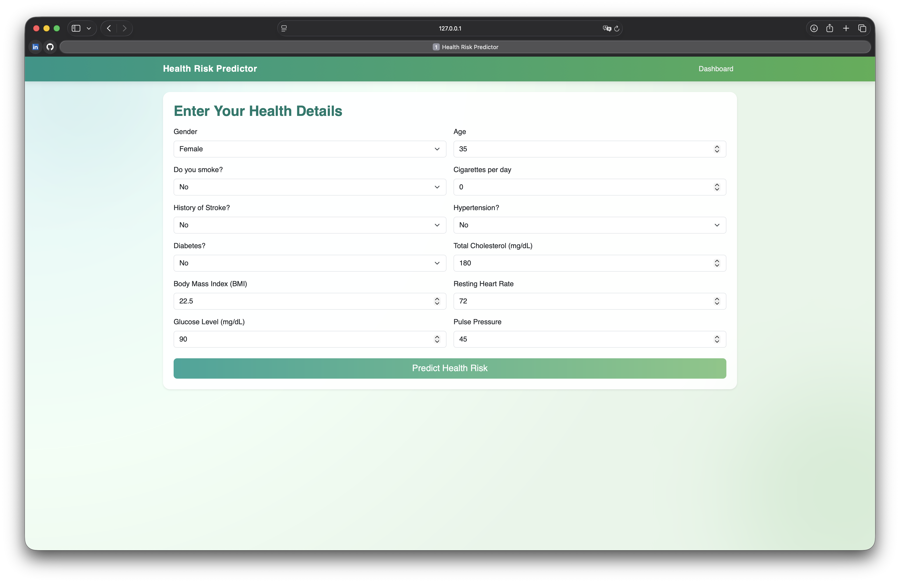
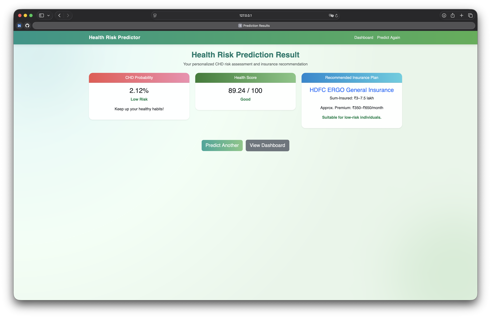

# Health Risk Predictor

A Machine Learning based system that predicts the **10-year risk of Coronary Heart Disease (CHD)** using health parameters and provides a **health score and insurance recommendation**.

Developed as part of **Machine Learning for Data Analytics (MLDA)**.

---

## Project Overview

Cardiovascular diseases are one of the leading causes of death worldwide.  
This project uses **Machine Learning and clustering techniques** to predict health risks based on medical parameters.

The system:

• Predicts CHD probability  
• Calculates a health score using clustering  
• Classifies users into risk groups  
• Recommends suitable insurance plans  

---

## Technologies Used

**Programming**
- Python

**Machine Learning**
- Scikit-learn
- KMeans Clustering
- Logistic Regression

**Backend**
- Flask

**Frontend**
- HTML
- CSS
- Bootstrap
- Chart.js

**Data Processing**
- Pandas
- NumPy

---

## Dataset

Dataset used:

**Framingham Heart Study Dataset**

Features include:

- Age
- Gender
- Smoking status
- Cigarettes per day
- Diabetes
- Hypertension
- BMI
- Heart rate
- Glucose
- Cholesterol
- Pulse pressure

Target variable:

```
TenYearCHD
```

---

## Machine Learning Pipeline

1. Data Loading  
2. Data Preprocessing  
3. Feature Scaling (StandardScaler)  
4. Logistic Regression Model Training  
5. CHD Probability Prediction  
6. Health Score Generation using **KMeans Clustering**  
7. Risk Group Classification  
8. Insurance Plan Recommendation  

---

## Risk Categories

The clustering model divides individuals into:

| Cluster | Risk Level |
|------|------|
| Cluster 0 | Low Risk |
| Cluster 1 | Moderate Risk |
| Cluster 2 | High Risk |

---

## Model Performance

| Metric | Value |
|------|------|
| Accuracy | ~85% |
| Precision | ~91% |
| Recall | ~82% |
| F1 Score | ~15% |
| ROC-AUC | ~0.73 |

---

## System Architecture



---

## Dashboard Features

The system dashboard visualizes:

• Health Score Distribution  
• CHD Probability Distribution  
• Cluster Distribution  
• Model Performance Metrics  

---

## Running the Project

### 1 Install dependencies

```
pip install -r requirements.txt
```

### 2 Run the application

```
python frontend/app.py
```

### 3 Open browser

```
http://127.0.0.1:5000
```

---

## Application Preview

### Input Form


### Prediction Result


### Dashboard


---

## Project Structure

```
health-risk-predictor
│
├── architecture
├── data
│   ├── raw
│   └── processed
│
├── frontend
│   └── app.py
│
├── templates
├── static
│
├── src
│
├── models
│
├── main.py
│
└── README.md
```

---

## Developers

**Mohan Narayanapuram**  
RA2311056010126

**D. Pujith Ram Reddy**  
RA2311056010153

---

## License

This project was developed for **academic purposes**.
